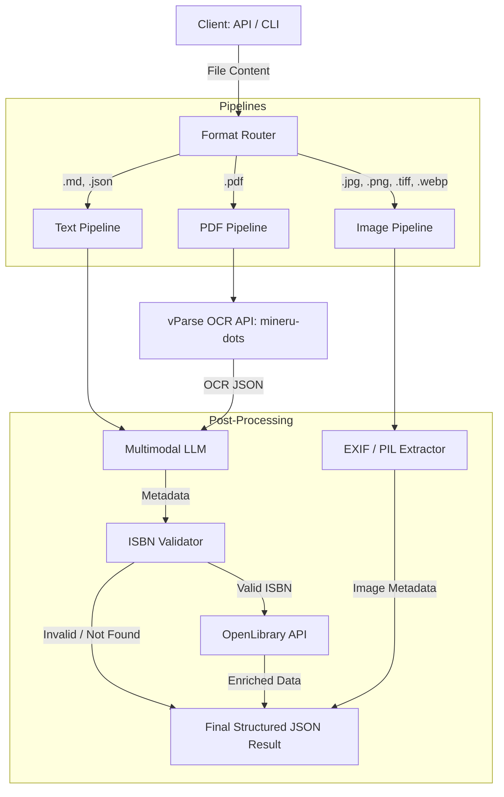

# Architecture: Multi-Format Metadata Extraction

## Description
The architecture centers around a **Format Router** that dispatches files based on their extensions to one of three specialized pipelines. 

1. **Text Pipeline**: For structured or markdown text files, the content is sent directly to the LLM.
2. **PDF Pipeline**: Delegates heavy OCR lifting to an external **mineru-dots (vParse)** service. The resulting JSON contains text and structural information which the LLM then parses for book-specific metadata.
3. **Image Pipeline**: A non-LLM pipeline that extracts technical file properties and EXIF data, normalizing GPS coordinates for consistency.

Metadata from book-related pipelines (Text/PDF) is further processed to validate ISBNs and enrich the data via the **OpenLibrary API** before returning the final response.

